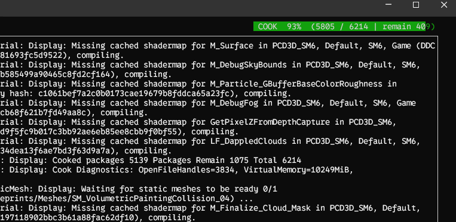
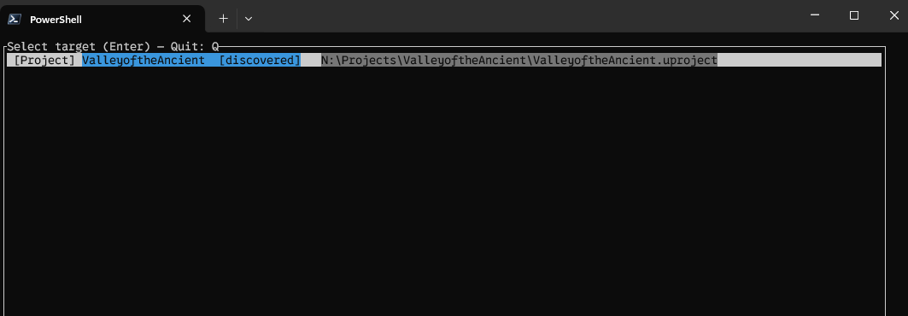

# ue-tui — Unreal Engine Text User Interface (TUI)

A tiny, cross‑platform terminal UI to watch Unreal Engine logs in real time.
Pick a project or a built executable, and ue-tui will follow the latest .log file,
render it clearly, and let you navigate/filter comfortably from the terminal.

Written in Rust using ratatui and crossterm.


## Highlights
- Simple project/build selection menu (reads from `projects.json` and auto‑discovers open editors)
- Real‑time tailing of the active log (starts from EOF to avoid flooding old lines)
- Optional timestamp display (first `[ ... ]` only; thread index `[ .. ]` is hidden)
- Category styling and instant filtering:
  - Lines like `... LogRenderer: message` show `LogRenderer:` underlined
  - Click on the category to filter by it; active filter is shown on the header (clear with `F`)
- Basic color highlighting for warnings/errors
- Smooth scrolling, optional word wrap, and a non‑intrusive status/footer
- COOK progress visualization in the header when detected



## Controls
- H: toggle help popup
- Q or Esc: quit
- S: back to the selection menu
- C: clear output and restart tail (jump to newest lines)
- T: toggle timestamp visibility
- W: toggle word wrap
- F: clear active category filter
- Up/Down: scroll by 1 line
- PageUp/PageDown: scroll by 10 lines
- Home/End: jump to start/end
- Mouse: left‑click on a category token (e.g., `LogRenderer:`) to filter by that category


## Configuration (projects.json)
ue-tui looks for `projects.json` in the following locations (first found wins):
1) Next to the executable
2) In the current working directory (useful for `cargo run`)
3) During debug builds: the project root at compile time

Example `projects.json`:
```json
{
  "projects": [
    {
      "key": "game",
      "name": "My UE Game",
      "uproject": "D:/UE/MyGame/MyGame.uproject"
    }
  ],
  "builds": [
    {
      "key": "game-dev",
      "name": "My UE Game (Dev Build)",
      "exe": "D:/UE/Builds/MyGame.exe"
    }
  ]
}
```
Fields (projects):
- key: short identifier used internally
- name: pretty name shown in the UI (optional; falls back to key)
- uproject: absolute or relative path to your `.uproject`

Fields (builds):
- key: short identifier used internally
- name: pretty name shown in the UI (optional; falls back to key)
- exe: absolute or relative path to a built game `.exe`

Log resolution rules:
- Projects: `<uproject_dir>/Saved/Logs/<ProjectName>.log`
- Builds: next to the `.exe` there must be a folder with the same name; logs are read from
  `<exe_dir>/<ExeName>/Saved/Logs/<ExeName>.log`. For example, `Quantumera.exe` with folder `Quantumera/`.

Auto‑discovery:
- ue-tui scans running processes for UE editor executables (UE4/UE5/UnrealEditor) and, when it can
  find a `*.uproject` argument, it adds those to the menu marked as `[discovered]` (no file needed).


## Build and Run (from source)
Prerequisites:
- Rust toolchain with Cargo (https://rustup.rs)

Build and run in debug mode:
```
cargo run
```
If your `projects.json` is not in the repo root, either run from the directory that contains it,
or place it next to the produced binary (e.g., `target\debug\ue-tui.exe` on Windows).


## Install locally with Cargo
Install the app to your Cargo bin directory:
```
cargo install --path .
```
This compiles in release mode and places the binary into Cargo's bin folder (e.g., `%USERPROFILE%\.cargo\bin` on Windows).
Ensure this folder is on your PATH.

After installation, run it from anywhere:
```
ue-tui
```
Provide a valid `projects.json` either in the current directory or next to the installed binary.

Update an existing installation:
```
cargo install --path . --force
```


## Notes and Troubleshooting
- If the UI shows a valid path but no lines, the log may not have new content yet; trigger activity or verify the path.
- The app intentionally starts tailing from EOF to avoid flooding old lines.
- Category detection expects a token like `Word:` with no spaces before the colon; lines without that form are still shown (just without a clickable category).
- Terminal rendering (underline/italic) depends on your terminal emulator.
- On Windows, ensure your terminal supports mouse events (Windows Terminal or newer PowerShell is recommended).
- Under very high log throughput, ue-tui may throttle display to keep the UI responsive (a notice appears in the footer).


## License
MIT License, see LICENSE.MD.